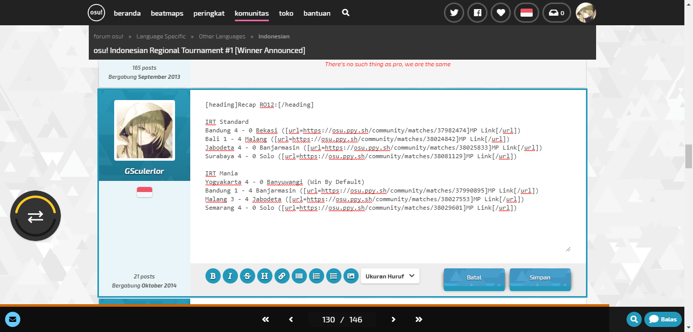
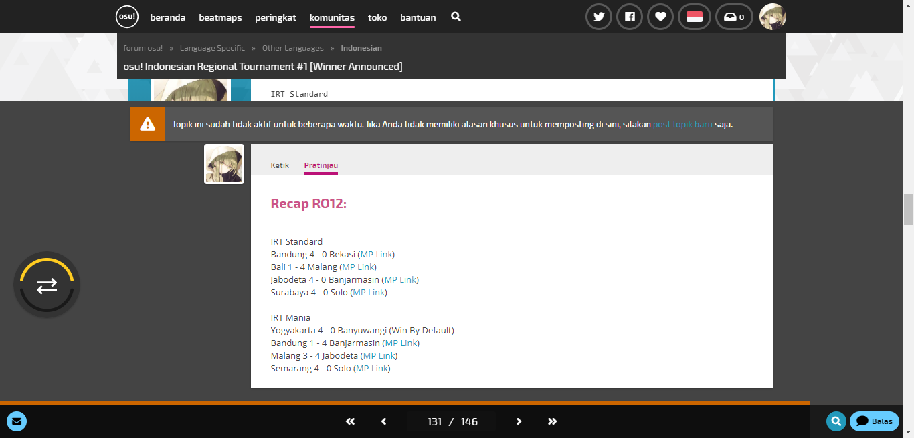
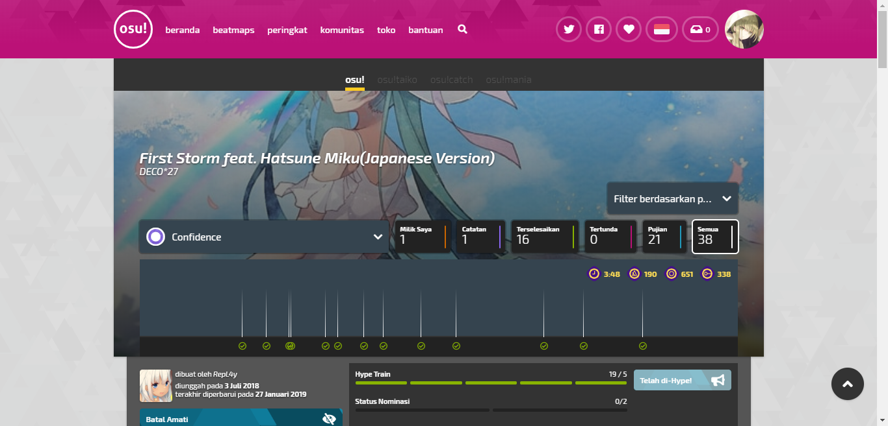
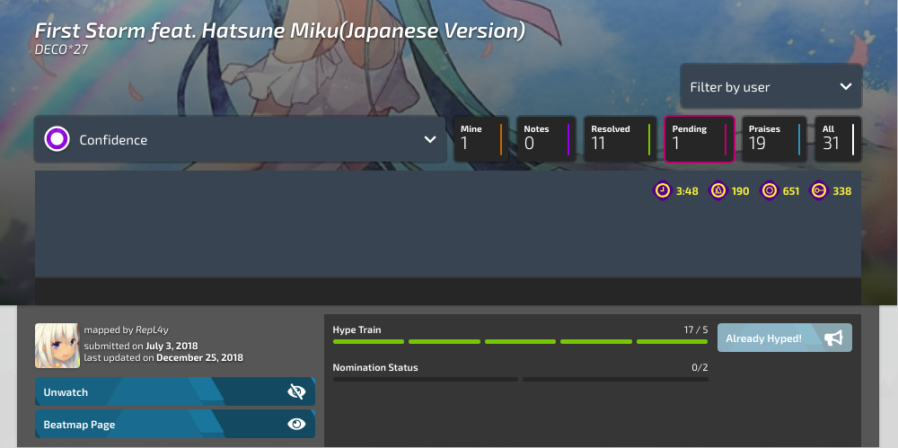

# Bad Design on osu-web
Ganendra Afrasya - 05111640000071 - HIC-A

### Background

osu-web is one of [osu!](https://osu.ppy.sh/) open source project from osu!dev. Since it's open source project and it's a transition phase between [old page](https://old.ppy.sh/), and new page with new design language created by [flyte](https://osu.ppy.sh/users/3103765), lot of page and design is neither half-implemented nor not follow the new design language. Here some of them that I found and I propose the change

#### No preview on edit post

This one I found it on forum. osu!forum support bbcode, so we can style our post. Of course many websites and forums already implement it, one of them is osu!forum. Unfortunately, osu!forum is lack of post preview feature when we want to change our post. Here's the pics

It's kinda inconsistence cause actually when we want to create new post, it actually have this feature

So for this one I propose to add preview feature on edit post cause it will be suck if we want to know if our styling is correct we must save it first or using reply post feature first

This one is already issued on osu-web repo ([#3892](https://github.com/ppy/osu-web/issues/3892))

#### osu!supporter purchase by sliderbar

This one is kinda funny, here the gif to show up what I mean why this one is bad design

For just 1 month, there are multiple price that actually have some different in "day" value, not in "month" value. 
This one, I propose to either change it to not use sliderbar or add day value beside month so user know what's the difference between USD 4 till USD 7 for 1 month purchase

This one is already issued on osu-web repo ([#3687](https://github.com/ppy/osu-web/issues/3687))

#### No feedback to user that the title is a redirect link

Look at this screenshot

Believe it or not, that title is actually a link that redirect user to respective beatmap page. There's no feedback to user that indicate if this one is a link even if user hover it. For this one I have 2 change propose, one is make it change when user hover it. This one is also make it consistent with other page

But this one still not make it obvious that is a link, right. So my second propose is make it not a link and add a button that obviously show to user that it redirect us to another page

This one I issued it on osu-web repo ([#4063](https://github.com/ppy/osu-web/issues/4063))